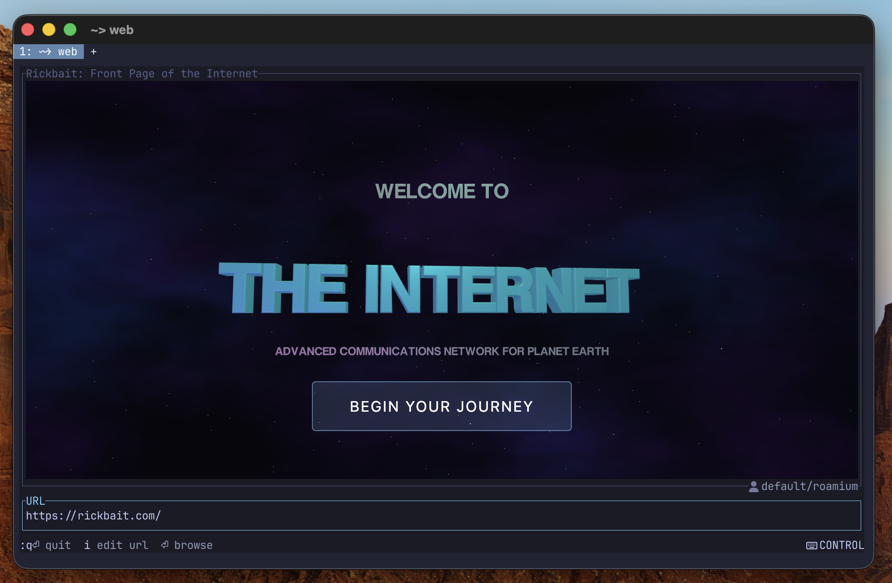

# Astrohacker Terminal

**A terminal with a browser in the pane.**

Type `web` and a full web browser opens right in your terminal pane. No window
switching. No context loss. Just web.

```bash
web ryanxcharles.com
```



## Why Astrohacker Terminal?

You're deep in a terminal session. You need to check docs, hit an API, or log
into a dashboard. The traditional workflow: Cmd+Tab to browser, lose your place,
Cmd+Tab back. Repeat dozens of times a day.

Astrohacker Terminal eliminates the context switch. Browser panes live alongside
terminal panes in the same window. You stay in flow.

## Features

### Browser Integration

- **Full Chromium** — Not a simplified renderer. Real DevTools, real JavaScript,
  real web. Embedded via the Content API (not CEF).
- **Zero-copy compositing** — CALayerHost lets Window Server composite directly
  from GPU VRAM. No per-frame IPC, no texture copies.
- **60fps Metal rendering** — Hardware-accelerated at Retina resolution.
- **Dynamic resize** — Browser pane resizes with window and splits.
- **Multi-pane** — Multiple browser panes in one window.
- **Profile isolation** — Separate cookies, sessions, and storage per profile.
- **Dark mode** — System color scheme forwarded to Chromium. Override with
  `:dark` or `:da`.
- **Chrome DevTools** — Open in a split pane with `:devtools` or `:de`.

### Mouse Input

- Click, drag, and scroll forwarded to browser
- Cursor changes (pointer, text, crosshair, etc.)
- Text selection
- Click-to-focus — clicking an unfocused pane activates it without passing the
  click through (macOS-style)

### Keyboard Input

- Full keyboard forwarding to Chromium in browse mode
- Cmd+key bypass — Cmd+C/V/A/X/Z go to browser, not terminal
- Clipboard integration

### Navigation

- URL bar with vim-style editing (edtui widget)
- Smart URL resolution — `web google.com`, `web ./file.html`, `web :3000`,
  `web devtools` all resolve correctly
- URL normalization — bare domains get `https://` prefix automatically
- `file://` support — `web file <path>` or `web ./path`
- Browser navigation: Cmd+[ (back), Cmd+] (forward), Cmd+R (reload)
- Loading progress indicator
- Page title display in viewport border
- Links open in same tab (no popups)
- Configurable homepage — `web` without args opens default page

### Vim-Style Modes

| Mode        | Behavior                                          |
| ----------- | ------------------------------------------------- |
| **Control** | Terminal keybindings active (default on startup)  |
| **Browse**  | Keyboard/mouse goes to the browser                |
| **Edit**    | Vim-style URL editing with Normal/Insert submodes |
| **Command** | `:` prefix for commands                           |

| Key    | Mode    | Action                      |
| ------ | ------- | --------------------------- |
| Esc    | Browse  | Switch to Control           |
| Enter  | Control | Switch to Browse            |
| i      | Control | Edit URL (insert at cursor) |
| A      | Control | Edit URL (insert at end)    |
| I      | Control | Edit URL (insert at start)  |
| n      | Control | Edit URL (normal mode)      |
| v      | Control | Edit URL (visual mode)      |
| V      | Control | Edit URL (visual line)      |
| :      | Control | Enter Command mode          |
| q      | Control | Quit                        |
| Ctrl+C | Any     | Force quit                  |

Context-sensitive Esc exits the current mode appropriately. Per-mode color
indicators follow the LazyVim Tokyo Night palette.

### Commands

| Command              | Shortcut | Action                      |
| -------------------- | -------- | --------------------------- |
| `:quit`              | `:q`     | Quit                        |
| `:dark [on\|off\|s]` | `:da`    | Toggle/set dark mode        |
| `:devtools [dir]`    | `:de`    | Open DevTools in split pane |

### UI

- Active pane indicator with colored borders and background desaturation
- Inner padding so borders don't cover content
- Purple border in Edit mode
- Tight title spacing

### Terminal

The primary Astrohacker Terminal frontend is Ghostboard, a
[Ghostty](https://ghostty.org/) fork with TermSurf protocol support. Native
terminal features, configuration, panes, tabs, and keybindings come from
Ghostty; Astrohacker Terminal adds browser integration on top. TermSurf remains
the protocol and legacy CLI/domain namespace used by existing tools and
documentation.

## Profiles

Like Chrome, Astrohacker Terminal supports isolated browser profiles. Each
profile has its own cookies, storage, and login sessions.

```bash
web google.com                      # Default profile
web --profile work slack.com        # Work profile (separate login)
web --profile personal github.com   # Personal profile (different account)
```

Run all three in the same terminal window. Each profile is completely isolated —
logging into Google in one profile doesn't affect the others.

## Getting Started

### Install with Homebrew

The Homebrew cask currently supports Apple silicon macOS and installs the
current Astrohacker Terminal app, the `web` CLI, the `termsurf` GTUI CLI,
Roamium with Chromium runtime resources, Surfari with WebKit runtime resources,
and the Girlbat/Ladybird prototype:

```bash
brew tap astrohackerlabs/astrohacker
brew trust astrohackerlabs/astrohacker
brew install --cask astrohacker-terminal
```

To upgrade: `brew update && brew upgrade --cask astrohacker-terminal`

### Build from Source

For development. Requires Xcode, Zig, Rust, Bun, and the ignored fork checkouts
under top-level `forks/`. Chromium and WebKit builds are large; plan for ~150 GB
of disk space for both engine workspaces.

#### 1. Install prerequisites

```bash
# macOS compiler toolchain
xcode-select --install

# Zig (Ghostboard)
brew install zig

# Rust (TUI, engine binary)
curl --proto '=https' --tlsv1.2 -sSf https://sh.rustup.rs | sh

# Bun (web workspaces)
curl -fsSL https://bun.sh/install | bash

# Chromium depot_tools (build system for Chromium)
git clone https://chromium.googlesource.com/chromium/tools/depot_tools.git forks/chromium/depot_tools
```

#### 2. Prepare fork checkouts and patches

Large upstream working trees live in top-level `forks/` and stay ignored by git.
Tracked Astrohacker changes live in top-level `patches/`.

Current local fork entries:

- `forks/chromium/src`
- `forks/webkit/src`
- `forks/ladybird`
- `forks/ghostty`
- `forks/gecko` when Waterwolf work begins

Patch workflow and branch naming are documented under `patches/`. In brief,
create issue-specific branches in the relevant ignored fork checkout, then
commit the generated patch archive under the matching `patches/<fork>/`
directory.

#### 3. Fetch and build Chromium

This is the big one. The initial fetch downloads ~50 GB of source code and the
first build takes ~1.5 hours. After that, incremental builds take 15–20 seconds.

```bash
cd forks/chromium
export PATH="$PWD/depot_tools:$PATH"

# Configure gclient to manage Chromium's src/ checkout
gclient config --name=src https://chromium.googlesource.com/chromium/src.git

# Sync Chromium and its dependencies at the current archived version
caffeinate gclient sync --revision src@148.0.7778.271 --no-history
```

`gclient config` creates the `.gclient` file that tells Chromium's tooling where
`src/` lives. `gclient sync --revision src@148.0.7778.271` checks out the
Chromium version Astrohacker Terminal currently tracks and fetches the matching third-party
dependencies, build tools, and SDKs. `caffeinate` prevents macOS from sleeping
during the long download.

Apply Astrohacker Terminal's current Chromium patch archive:

```bash
cd src
git checkout 148.0.7778.271
git checkout -b 148.0.7778.271-issue-860
git am ../../../patches/chromium/patches/issue-860/*.patch
```

Configure and build Chromium:

```bash
gn gen out/Default --args='is_debug=false symbol_level=0 is_component_build=true enable_nacl=false'
autoninja -C out/Default libtermsurf_chromium
```

**Always use `autoninja`, never `ninja` directly.** Using `ninja` even once
permanently downgrades the build directory and the only recovery is a full
rebuild. See top-level `patches/chromium/README.md` for branch and patch
workflow details.

#### 4. Build tracked workspaces

```bash
cd rust
cargo build --workspace

cd ../bun
bun install
bun run build:website
bun run build:terminal-website
bun run build:terminal-cloud
```

`rust/` builds the `web`, `termsurf`, `roamium`, `surfari`, `girlbat`, and
Roastty support targets. `bun/` builds the Astrohacker website, Astrohacker
Terminal website, Terminal Cloud package, and GTUI app support code.

The compatibility build helper under `terminal/scripts/build.sh` uses the new
monorepo paths while preserving the old component names:

```bash
terminal/scripts/build.sh webtui
terminal/scripts/build.sh gtui
terminal/scripts/build.sh roamium
terminal/scripts/build.sh surfari
terminal/scripts/build.sh girlbat
terminal/scripts/build.sh ghostboard
```

#### 5. Build the patched Ghostty app

```bash
cd forks/ghostty
zig build -Demit-macos-app=false
macos/build.nu --scheme Ghostty --configuration Debug --action build
```

The app output is
`forks/ghostty/macos/build/Debug/Astrohacker Terminal.app`. Launch that app and
run:

```bash
web google.com
```

## Documentation

Current public documentation still lives at the legacy
[termsurf.com/docs](https://termsurf.com/docs) domain while the Astrohacker
Terminal rename is completed.

## Contributing

See [CLAUDE.md](./CLAUDE.md) for architecture details, build instructions, and
the full development guide.

## License

[MIT](./LICENSE). See [TRADEMARKS.md](./TRADEMARKS.md) for trademark policy.
